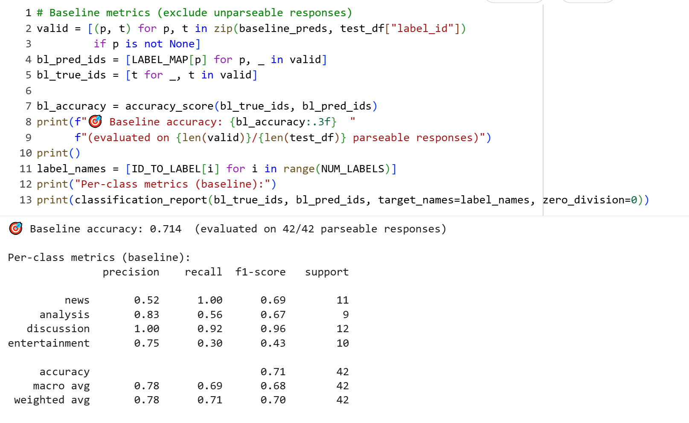

# ai201-project3-takemeter

## Baseline Model Analysis

Quick observations and screenshots from initial model runs for future reference.

### Observations

- Baseline model did pretty well with 71% overall accuracy, and per class accuracy metrics >70% for all labels except news. News were confused with entertainment and analysis labels.

### Screenshots

- 