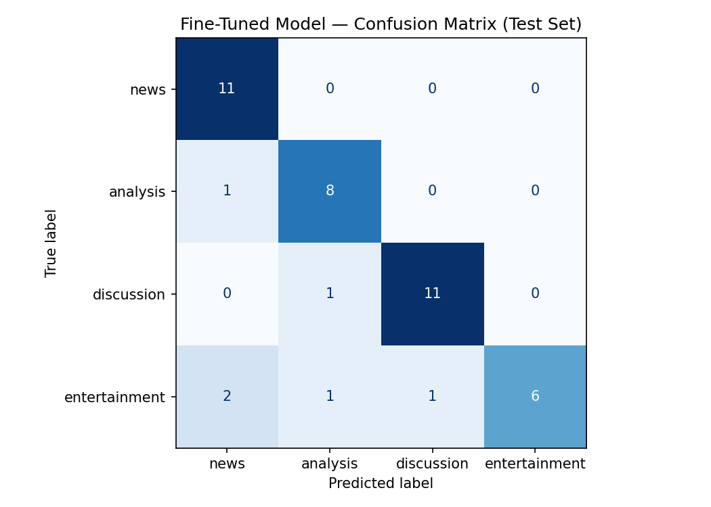

# ai201-project3-takemeter

## Baseline Model Analysis

Quick observations and screenshots from initial model runs for future reference. 

### Hyperparameter Adjustments

| Parameter | Default | Adjusted | Reason |
|-----------|---------|----------|--------|
| Epochs | 3 | 6 | With 3 epochs the loss function barely reduced, indicating minimal learning. Increasing to 6 epochs allowed the loss to decrease from ~1.4 (epoch 1) to ~0.7 (epoch 6), showing meaningful convergence. |

### Observations

- Baseline model did pretty well with 71% overall accuracy, and per class accuracy metrics >70% for all labels except news. News were confused with entertainment and analysis labels.

### Fine-Tuned Model — Confusion Matrix (Test Set)

|  | Predicted: news | Predicted: analysis | Predicted: discussion | Predicted: entertainment |
|--|:-:|:-:|:-:|:-:|
| **True: news** | **11** | 0 | 0 | 0 |
| **True: analysis** | 1 | **8** | 0 | 0 |
| **True: discussion** | 0 | 1 | **11** | 0 |
| **True: entertainment** | 2 | 1 | 1 | **6** |

**Per-class accuracy:** news 100% (11/11) · analysis 89% (8/9) · discussion 92% (11/12) · entertainment 60% (6/10)

**Overall accuracy: 86% (36/42)**

**Reading the matrix:** The diagonal cells are correct predictions; off-diagonal cells are errors. News and discussion are the strongest labels — the model makes zero errors on news and only one on discussion. Analysis loses one post to news, likely a stat-heavy post that reads like a wire item without original synthesis. Entertainment is the weakest label: 4 of its 10 posts are misclassified — 2 as news, 1 as analysis, and 1 as discussion. The dominant confusion pattern is entertainment being mistaken for news, consistent with the hard edge case identified in planning.md where a post contains a trivial new fact but its appeal is mostly tonal.

Supplementary image: 
